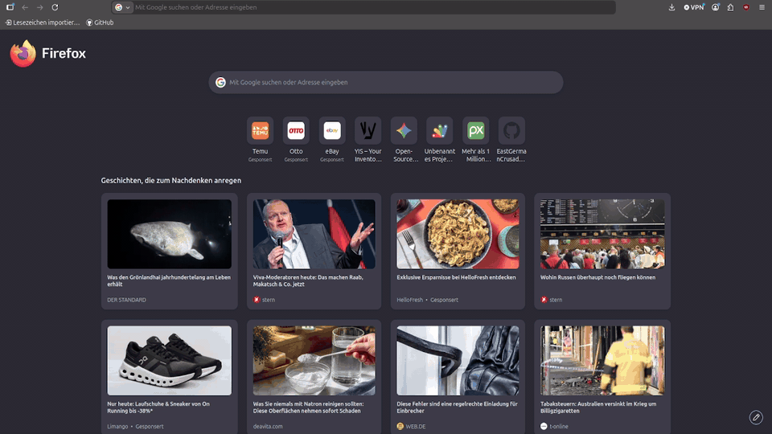

# YIS – Your Inventory System

[](LICENSE)


YIS ist ein leichtgewichtiges, webbasiertes **Inventar- und Lagersystem**, das maximale Flexibilität mit minimalem Infrastruktur-Aufwand kombiniert. Es nutzt ein modernes HTML5/JS-Frontend und verwendet eine **Google Tabelle als serverlose, kostenlose Datenbank**. Die Kommunikation erfolgt sicher über eine maßgeschneiderte Google Apps Script API.



---

## 🚀 Kernfunktionen

* **Öffentliche Schnellansicht (Scan & Go):** Direkter Aufruf digitaler Objektakten via QR-Code oder dedizierter URL-Parameter (`?sn=SERIENNUMMER`) – komplett ohne vorherigen Login.
* **Autonomes Daten-Seeding:** Das Frontend initialisiert und strukturiert die Google Tabelle beim ersten Start vollautomatisch. Es sind keine manuellen SQL- oder Tabellen-Setups nötig.
* **Sichere Verwaltung:** Passwortgeschützter Administrationsbereich zur Pflege des Inventars, Generierung standardisierter Seriennummern (`YIS-YYYYMMDD-0001`) und Erstellung von QR-Codes.
* **Integrierte Dateianlagen:** Direkter Upload von Dokumenten oder Bildern (bis zu 1,5 MB) pro Objekt, die isoliert im Tabellenblatt „Anlagen“ hinterlegt werden.
* **Rich UX:** Interaktives Fehlerprotokoll für nahtloses Debugging, animierter Splash-Screen und auditives Benutzerfeedback (UI-Sounds).

---

## 🛠️ Technische Architektur & Sicherheit

YIS wurde nach dem Prinzip des *Zero-Knowledge-Hostings* für API-Endpunkte entworfen:

| Sicherheitskomponente | Mechanismus | Zweck |
| :--- | :--- | :--- |
| **Transportsicherheit** | `shield.js` (AES-256-GCM) | Die Google Web-App-URL wird kryptografisch verschlüsselt im Build hinterlegt und erst nach erfolgreicher Client-Authentifizierung im Speicher entschlüsselt. |
| **API-Schutz** | Statischer Token-Abgleich | Schreib- und Upload-Aktionen (`list`, `write`, `upload`) erfordern einen kryptografischen Token, der synchron in `App.gs` und der Client-Konfiguration hinterlegt ist. |
| **Public Read** | Validierte Parameter-Abfrage | Der unschätzbare, öffentliche Lesezugriff erlaubt ausschließlich isolierte Abfragen via exakter Seriennummer (`get?sn=...`). |

---

## 💻 Schnellstart (Eigene Instanz aufsetzen)

### Voraussetzungen
* Node.js & npm (für den Build-Prozess)
* Ein Google-Konto (für Google Sheets & Apps Script)

### Installationsschritte
```bash
# 1. Repository klonen
git clone [https://github.com/EastGermanCrusader/YIS-Your_Inventory_System.git](https://github.com/EastGermanCrusader/YIS-Your_Inventory_System.git)
cd YIS-Your_Inventory_System

# 2. Lokale Konfigurationsdateien aus Vorlagen generieren
npm run setup

# 3. Umgebungsvariablen konfigurieren
# Befülle die neu erstellten Dateien (token.txt, url.txt, Bereitstellungs-ID.txt) 
# sowie google-apps-script/App.gs gemäß der SETUP.md.

# 4. Produktion-Build erstellen (Generiert die verschlüsselte shield.js)
npm run build

# 5. Lokalen Entwicklungsserver starten
./serve.sh
